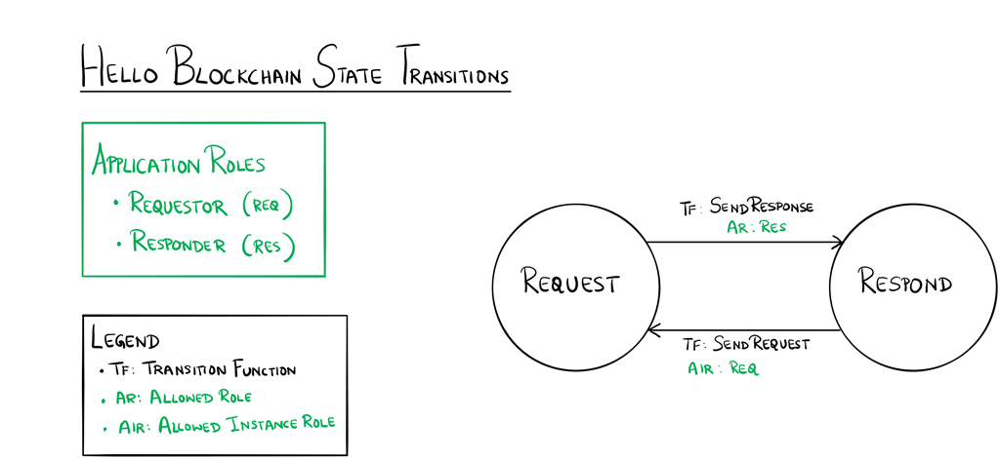

Hello Blockchain Sample Application for Asch
==================================================================
[inspired by](https://github.com/Azure-Samples/blockchain/tree/master/blockchain-workbench/application-and-smart-contract-samples/hello-blockchain)

Overview 
---------

The Hello Blockchain application expresses a workflow between a person sending
a request and a person responding to the request.  The state transition diagram
below shows the interactions between the states in this workflow. 

Application Roles 
------------------

| Name  |  Description |
|------------|-------------------------------------------------------------------------------------------|
| Requestor  |  The party that initiates the "Hello blockchain!" request                                 |
| Responder  |  The party that responds to the Requestor |


States 
-------

| Name  |  Description |
|----------|-------------------------------------------------------------------------------------------|
| Request  | The state that occurs when a request has been made.  |
| Respond  | The state that occurs after a response has been made to the request.  |

 

Workflow Details
----------------


 
An instance of the Hello Blockchain application's workflow starts in the Request
state when a Requestor makes a request.  The instance transitions to the Respond
state when a Responder sends a response.  The instance transitions back again to
the Request state when the Requestor makes another request.  These transitions
continue for as long as a Requestor sends a request and a Responder sends a
response. 

## Install Asch first

```
# clone asch
git clone https://github.com/aschplatform/asch.git asch && cd asch && npm install && cd ..
```

## Install the source code
```
git clone https://github.com/bassjobsen/hello-blockchain-dapp.git
```
After that navigate to the new `asch-test-dapp` folder and follow the instruction at [Dapp Development Tutorial 1: Asch Dapp Hello World](https://github.com/AschPlatform/asch-docs/blob/master/dapp/hello_world/en.md). Or simply run [asch-redeploy](https://github.com/AschPlatform/asch-redeploy):

```
> sudo npm -g install asch-redeploy
> cd hello-blockchain-dapp
> asch-redeploy
```